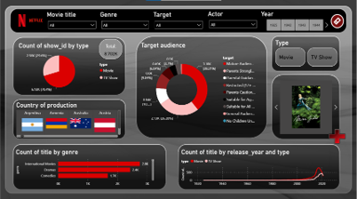
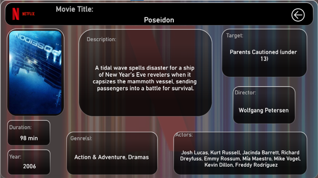

# 🎬 Behind the Screens: A Netflix Data Story

Welcome to the **Netflix Dashboard Analysis** project — an end-to-end data story built to explore, clean, and visualize Netflix's catalog in a compelling and interactive way. This project combines data engineering, SQL, API integration, and dashboard design using Power BI.

---

## 📊 Project Overview

This project analyzes the Netflix dataset to uncover insights about content distribution, duration, release trends, countries involved, and more. It also includes dynamic visual enhancements such as movie posters and country flags to create a rich and engaging user experience.

---

## 📁 Repository Structure

```Netflix-Dashboard-Analysis/
├── 1_data/ # Raw dataset, cleaned dataset, posters and countries files 
├── 2_cleaning/ # Data cleaning and preprocessing script
├── 3_sql/ # PostgreSQL scripts for database structure and queries
├── 4_posters/ # Movie posters fetching
├── 5_dashboard/ # Power BI file and dashboard resources
├── 6_presentation/ # Final report and presentation materials
└── README.md # This file
```
---

## 🚀 How to Use the Project

### 1. 🖥️ View the Dashboard Online (Recommended)

- 👉 [Click here to explore the live Power BI Dashboard](https://app.powerbi.com/links/jP6Nlgp4Zj?ctid=e2c8f23b-7029-4500-8037-7b8982a4f814&pbi_source=linkShare)  
  *(Interactive and read-only – no installation required)*

---

### 2. 💾 Download the Power BI Dashboard (Offline)

   - Go to the [`5_dashboard/Dashboard`](https://github.com/Shirel25/Netflix-Dashboard-Analysis/tree/main/5_dashboard/Dashboard) folder in this repository.
   - Download the file `netflix_dashboard.pbix`.
   - Open it with [Power BI Desktop](https://powerbi.microsoft.com/desktop/).

---

### 3. 🔎 Explore the Interactive Features

   - Filter by title, genre, audience, actor, release year, type or poster.
   - Enjoy the custom gallery view with **movie posters** and **country flags**.
   - Visualize key insights such as genre breakdown, trends over time and content distribution.

--- 

> 💡 *Want to understand or reproduce the full pipeline?*  
> You can explore the folders:
> - `2_cleaning/` for data preprocessing  
> - `3_sql/` for database schema and queries  
> - `4_posters/` for TMDB poster API integration

---

## 🌍 Data Sources

- [Netflix Shows Dataset on Kaggle](https://www.kaggle.com/datasets/shivamb/netflix-shows)
- [TMDB API](https://www.themoviedb.org/documentation/api) for movie posters
- Country flag URLs from [flagcdn.com](https://flagcdn.com/)
- [Inspiration video for the dashboard style](https://www.youtube.com/watch?v=ZSrVOyKAC4Y&list=PLrHF9RH5-_uuWyV0Ebr7MV_9Qj_4T5t9N&index=31)

---

## 🎯 Key Features

- Clean and structured data pipeline: from raw CSV to PostgreSQL with enriched metadata
- Normalized PostgreSQL schema and duration parsing (movies vs TV shows)
- Poster retrieval using TMDB API and dynamic image integration
- Use of Power BI custom visuals (HTML Content) for gallery-style image display
- Multi-criteria filtering (title, genre, audience, country, actor, year, etc.)
- Interactive and visually enriched storytelling dashboard


---

## 📸 Preview





---

## 👩‍💻 Author

**Shirel Amozieg**  
Data Analyst  
Passionate about data, insight generation, and storytelling  
[LinkedIn](https://www.linkedin.com/in/shirel-amozieg/)

---

## 📄 License

This project is for educational and portfolio purposes only.  
Please do not reuse or redistribute without explicit permission.

---

## 🙌 Acknowledgements

Thanks to the Kaggle and TMDB communities for making amazing datasets and APIs available.    
Special thanks to **Power BI Park** for inspiring the visual design of this dashboard.  
And above all, huge thanks to the [Developers Institute](https://developers.institute/), the training that awakened my passion for data and gave me the tools to bring this project to life. 